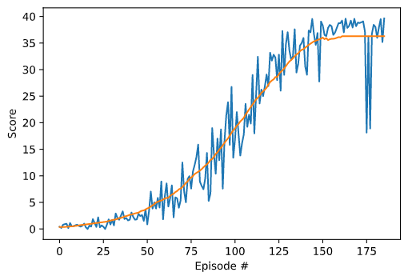

# Summary

In this report I present the implemented algorithms along with the training results and ideas for future work. The goal of the project was to solve the Reacher environment containing a double kointed arm and to train the agent maintain its position at the target location for as many time steps as possible.

A reward of +0.1 is provided for each step that the agent's hand is in the goal location. The task is considered solved, when the agent reaches an average score of >= 30 in 100 consecutive episodes.

The state space has 33 dimensions and contains the position, rotation, velocity, and angular velocities of the arm. Given this information, the agent has to learn how to best select actions in a continouos action space. Four ctions are available, corresponding to torque applicable to two joints. Every entry in the action vector should be a number between -1 and 1.

# Algorithms
## Deep Deterministic Policy Gradient (DDPG)
The algorithm introduced in the [DDPG paper](https://arxiv.org/abs/1509.02971) uses two deep neural networks, called actor and critic. Tha actor approximates the optimal policy deterministically, which means it wants to deliver the best believed action in any given state. The critic is used to approximate the maximizer over the Q values of the next state.

As DDPG could also be viewed as a DQN specifically for continuous spaces, a few features explored  for DQN will be also used with DDPG:

- **Experience replay**: When an agent interacts with the environment, the sequence of experiences can be highly correlated - causing a risk of "getting swayed" by the effects of this correlation. Instead of learning from the experience sequential, an experience buffer is maintained which is than sampled randomly during training.
- **Fixed Q-Targets**: In Q-Learning, we update a guess with a guess, and this can potentially lead to harmful correlations. To avoid this, we can update the parameters by using a separate, fixed network that is not changed during the learning step.

## Exploration
The exploration of the action space is done by applying noise to the action directly. Similar to the DDPG paper, the [Ornstein-Uhlenbeck Process](https://en.wikipedia.org/wiki/Ornstein%E2%80%93Uhlenbeck_process) is applied which produces temporally correlated noise in order to explore physical environments with momentum.It models the velocityof a Brownian particle with friction, which results in temporally correlated values centered around 0.

## Prioritized Experience Replay
The idea of [PER](https://arxiv.org/abs/1511.05952) is to prioritize experiences that may be more important than others. If we sample the experience buffer uniformly, we may "miss out" on experiences that occour less frequently, but contain important information (produce a bigger TD-error) and the agent could learn much from it. In order to make sure those experiences will be selected, a probability is assigned to all experiences based on their TD-error: experiences with a higher information content (thus a higher TD-error) will be sampled with a higher probability.

# Results

The agent solves the environment in 86 episodes. 
Although I did not do an extensive hyperparameter tuding, I tested multiple network structures with 2-3 hidden layers containing 32-400 units each. I found that - similar to the DDPG paper - the net structure with 2 hidden layers (300 and 400 units) worked best. Using batch normalization and implementing prioritized experience replay led to a faster training.

## Scores
The following plot shows the scores together with the moving average with a window size of 50:

## Hyperparameters
The hyperparamters used by the agent are listed in the following table:

| Hyperparameter | Value   | Description                                             |
|----------------|---------|---------------------------------------------------------|
| BUFFER_SIZE    | 1e6     | replay buffer size                                      |
| BATCH_SIZE     | 256     | batch size                                              |
| GAMMA          | 0.99    | discount factor                                         |
| TAU            | 0.001   | factor for soft update of the target network parameters |
| LR_ACTOR       | 3e-4    | learning rate actor                                     |
| LR_CRITIC      | 3e-4    | learning rate critic                                    |
| WEIGHT_DECAY   | 0.0     | weight decay critic                                     |
| UPDATE_EVERY   | 4       | how often to update the network                         |

For a more detailed parameter list see `src\config.py`.

## Trained Model
The trained actor model is in [this file](./results/actor.pth).
The trained critic model is in [this file](./results/critic.pth).

# Ideas for Future Work
**Experiment with different network structure**: The current network structure is just an example. I experimented with a few other ones, and selected the one that worked "the best" but further experiments could definitely lead to better performing structures.

**Explore the models parameter space**: in this project I focused on the implementation and first comparison of the algorithms presented int he course. I used the same hyperparameters for all agents and there is no garantee that those parameters are optimal. Therefore a systematic evaluation of the hyperparameters would be a good start, e.q. using grid search.

**Algorithms**: Exploring other algorithms, like Trust Region Policy Optimization (TRPO) and Truncated Natural Policy Gradient (TNPG) could also bring interesting results.

# Notes
The project uses the code and task description provided in the **[Udacity Deep Reinforcement Learning Nanodegree](https://www.udacity.com/course/deep-reinforcement-learning-nanodegree--nd893)**  class as a basis.